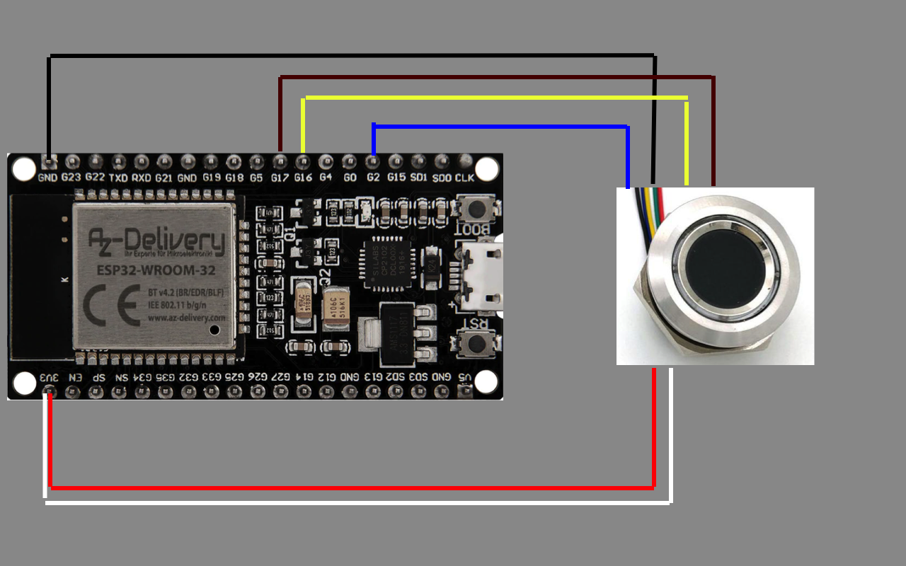
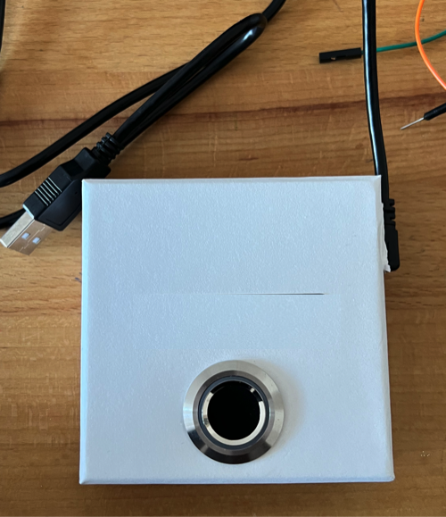

# fingerprint2pass

## Idea

The idea is to use a fingerprint as a password.

## Inspired by

- [project](https://esp8266-server.de/fingerprint.html)
- [github repo](https://github.com/MichaelDworkin/Fingerprint-Macro-Key-USB-HID)

## Prerequisites

- VSCode with PlatformIO
- ESP32 board
- R503 Fingerprint module

## Setup

### 1.  register fingerprints

Build & Upload [setup](./setup) project:

```bash
pio run --target upload
```

Connect to the board:

```bash
pio device monitor -b 115200
```

Supported commands:

```text
p - set fingerprint module access password
d - delete fingerprint
r - register fingerprint
```

### 2. use fingerprints

Create *main/include/MacrosPass.h* file and map your fingerprints:

```text
// |p - Press         "|p0x80 "  press STRG
// |r - Release       "|r0x80 "  release STRG
// |a - Release All   "|a "      release all keys
// |w - Write         "|w0xB0 "  press ENTER
// |t - Timer         "|t3000  " wait 3 seconds

const String data[10] =
    {
        "password1|w0xB0 ", // fingerprint ID 1
        "password2|w0xB0 ", // fingerprint ID 2
        "password3|w0xB0 ", // fingerprint ID 3
        "password4|w0xB0 ", // fingerprint ID 4
        "password5|w0xB0 ", // fingerprint ID 5
        "password6|w0xB0 ", // fingerprint ID 6
        "password7|w0xB0 ", // fingerprint ID 7
        "password8|w0xB0 ", // fingerprint ID 8
        "password9|w0xB0 ", // fingerprint ID 9
        "password10|w0xB0 ",// fingerprint ID 10
};
```

Build & Upload [setup](./main) project:

```bash
pio run --target upload
```

## :bomb: REMOVE, ENCRYPT OR DELETE YOUR PASSWORDS FROM THE FILE :bomb:

```text
main/include/MacrosPass.h
```

## Pictures

### wiring



### full setup



## Links

### Original Idea

- <https://esp8266-server.de/fingerprint.html>
- <https://github.com/MichaelDworkin/Fingerprint-Macro-Key-USB-HID>

### ESP32 board

<https://smile.amazon.de/gp/product/B071P98VTG>

### R503 fingerprint module

<https://de.aliexpress.com/i/33053783539.html>

### User manual

[R503 fingerprint module](R503_fingerprint_module.pdf)
